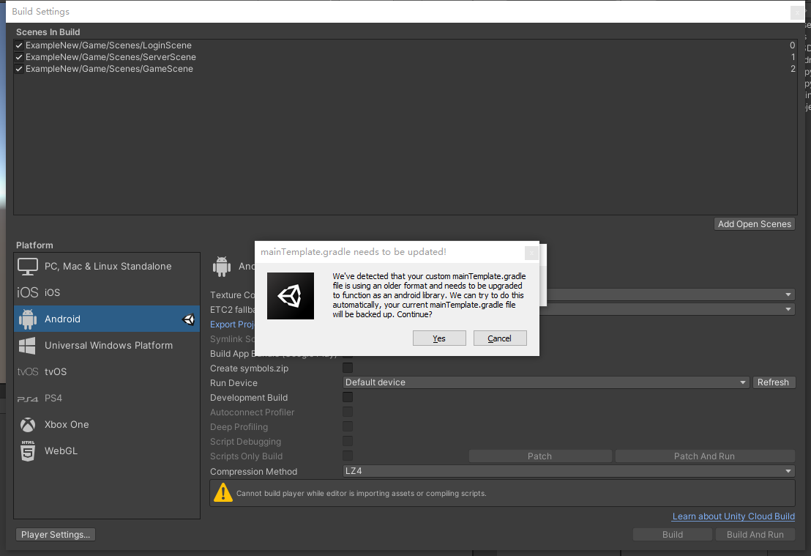
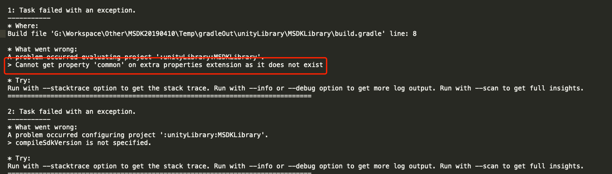

# MSDKV3 Unity Gradle接入指导

### 支持Unity引擎版本

已支持、验证的引擎列表和相应Gradle版本如下：

|引擎|Gradle版本|Gradle Android版本|备注|
|----|----|----|----|
|Unity 5.x|2.x|2.x|Unity 5.x Gradle版本较低，建议升级|
|Unity 2017|4.0.1|2.3.0|注意使用默认版本的Gradle，升级可能有Bug|
|Unity 2018|4.2.1|3.0.1|无|
|Unity 2019.3 以下（不包含2019.3）|4.6.0|3.0.1|无|
|Unity 2019.3 及以上|5.1.1|3.2.0|无|

注：Gradle和Gradle Android版本可以有相应调整，但不要太大跨度，容易造成引擎Bug。

### 使用方法

#### 步骤一：

MSDKV3 Unity Gradle额外提供两个Gradle脚本：mainTemplate.gradle和build.gradle，请将前者拷贝到 Plungins/Android 目录，如果业务已经有 mainTemplate.gradle，则合并；后者拷贝覆盖到 MSDK/Editor/Librarys/Android 3.2/MSDKLibrary 中，修改之后需要重新 Deploy 部署。

#### 步骤二：

- mainTemplate.gradle 文件
针对不同Unity引擎选择不同的Gradle Android版本

```java
dependencies {
   // Unity 2019.3及以上版本
   classpath 'com.android.tools.build:gradle:3.2.0'
   // Unity 2018，Unity 2019.3以下（不包含2019.3）
   //classpath 'com.android.tools.build:gradle:3.0.1'
   // Unity 2017
   // classpath 'com.android.tools.build:gradle:2.3.0'
   // Unity 5.x
   // classpath 'com.android.tools.build:gradle:2.1.2'
}

// Unity 2019.3及以上版本使用“.library”; Unity 2019.3以下版本（不包含2019.3）,使用 “.application”
apply plugin: 'com.android.library'

// Unity 2019.3及以上版本需要注释 applicationid；Unity 2019.3以下版本保留
// applicationId '**APPLICATIONID**'
```

- buid.gradle 文件
针对不同的Unity引擎选择不同的获取方法

```java
// Unity 2019.3及以上版本
compileSdkVersion getParent().ext.common.compileSdkVersion
buildToolsVersion getParent().ext.common.buildToolsVersion
// Unity 2019.3以下版本（不包含2019.3）
// compileSdkVersion rootProject.ext.common.compileSdkVersion
// buildToolsVersion rootProject.ext.common.buildToolsVersion
```

### 步骤三：

外网业务需要把 maven 仓库都换成 jcenter() 和 google()。如果 gradle 版本在 3.+ 以下，可能不支持 google() 写法，需要使用 url 'https://maven.google.com' 的形式，可以参考 [https://stackoverflow.com/questions/46467561/difference-between-google-and-maven-url-https-maven-google-com](https://stackoverflow.com/questions/46467561/difference-between-google-and-maven-url-https-maven-google-com) 中的说明。

> url 形式的 maven 仓库可能会变化，如果不存在需要业务自己找最新的

#### 已知问题说明

1、引擎兼容问题处理

由于Unity 5.x的Gradle编译与高版本引擎Gradle编译存在差异，主要是因为5.x引擎Gradle编译存在缺陷，不能编译Java文件，因此，Unity 5.x使用了预编译的msdk_unity_adapter。而高版本则删除msdk_unity_adapter，已经通过gradle脚本再mainTemplate中实现。

2、Unity 5.x 、Unity 2017 低版本 MINSDKVERSION 不存在

Unity 引擎默认在mainTemplate.gradle中写入必要配置，高版本支持MINSDKVERSION，低版本可能不支持，因此，如果遇到：minSdkVersion为空的错误，可以修改mainTemplate.gradle中MINSDKVERSION，并设定为具体数值

3、编译报错：

```java
No resource identifier found for attribute 'usesCleartextTraffic' in package 'android'
```

usesCleartextTraffic 是 target api 28的配置，可修改 mainTemplate.gradle 中compileSdkVersion 为 28

4、Unity 5.x 编译报错：

```java
> Error: NDK integration is deprecated in the current plugin.  Consider trying the new experimental plugin.  For details, see http://tools.android.com/tech-docs/new-build-system/gradle-experimental.  Set "android.useDeprecatedNdk=true" in gradle.properties to continue using the current NDK integration.
```

可删除 mainTemple.gradle 中的 NDK 配置

```
 ndk {
            abiFilters **ABIFILTERS**
        }
```

5、Unity 2019.3及以上版本的Gradle构建有变更，mainTemplate.gradle和buid.gradle如果没有按要求配置，可能会无法打包，报错信息可能：





出现如上错误，需要确认以下处理：

1）检查`步骤二`是否有针对不同Unity 引擎选择不同的方法<br>
2）检查{Unity}/Plugis/Android中AndroidManifest.xml文件，是否有将其中的.MainActivity修改为com.example.wegame.MainActivity。如果还有其它组件配置为{.*}，则一并在前面补全包名为com.example.wegame（注意：`com.example.wegame` 需要替换为业务自己的包名）
